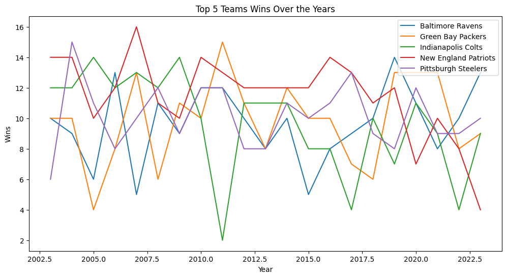
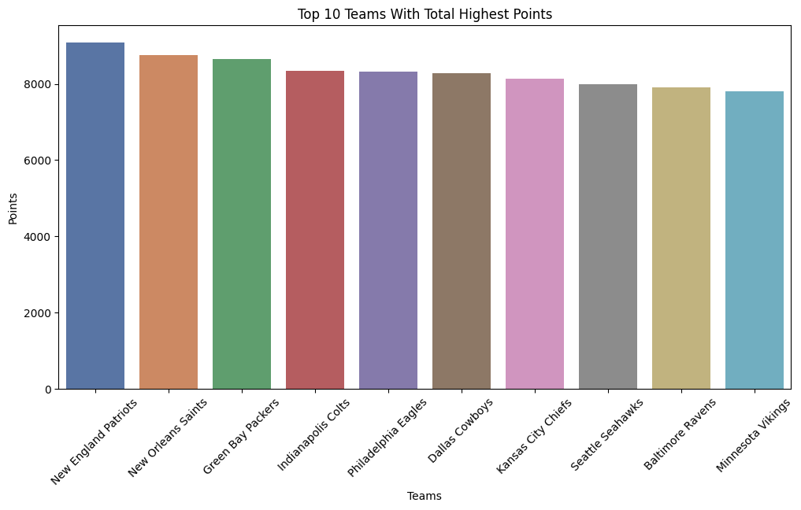
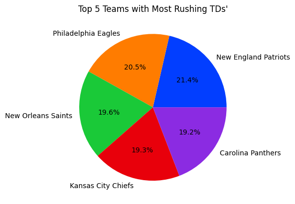
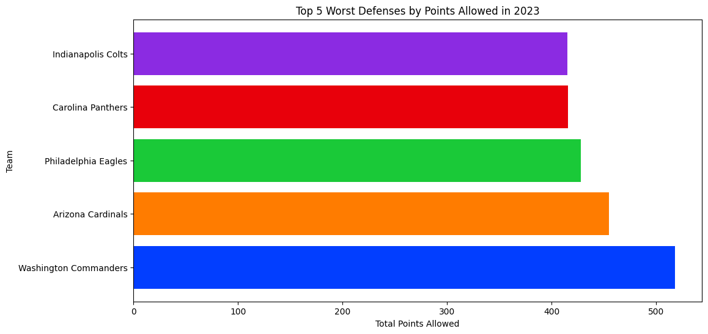
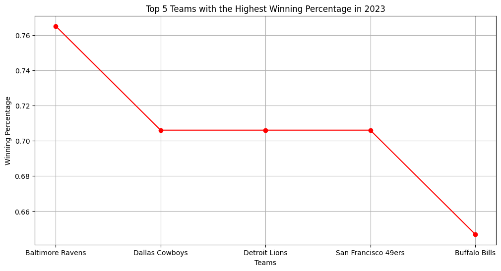
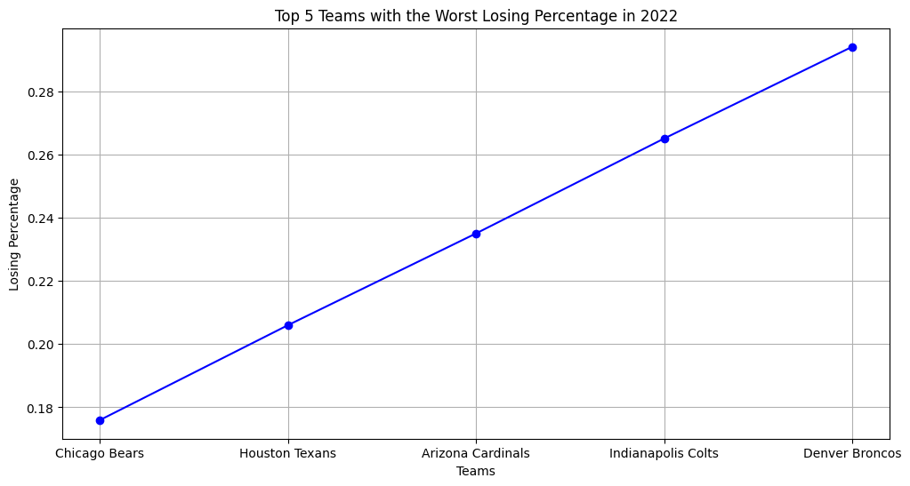
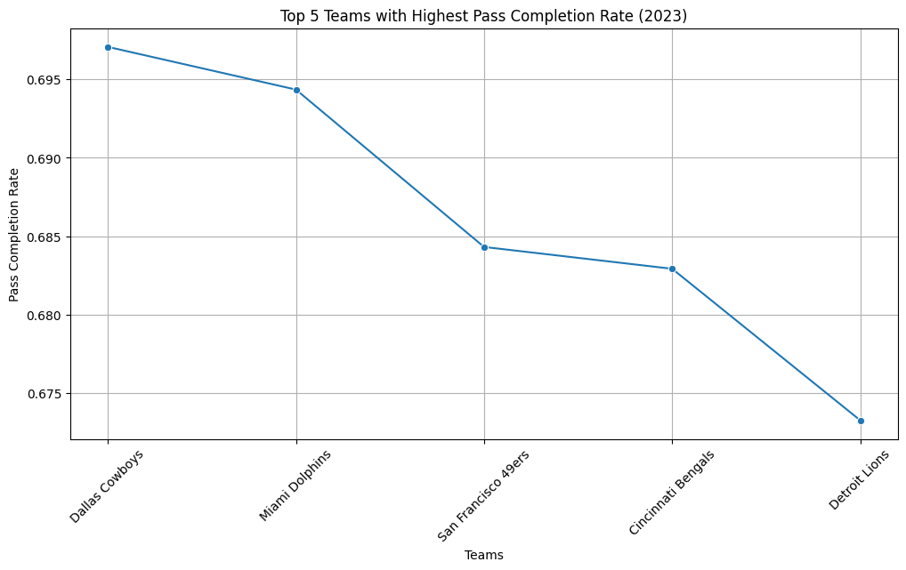
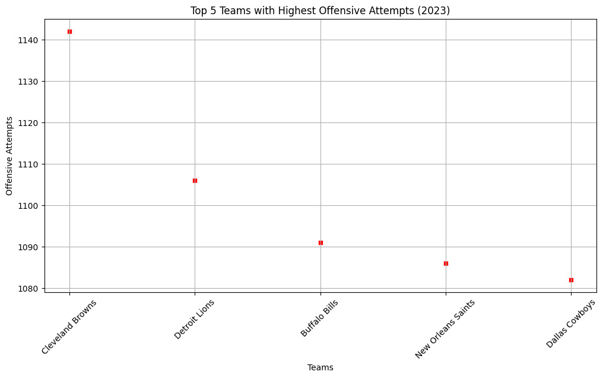
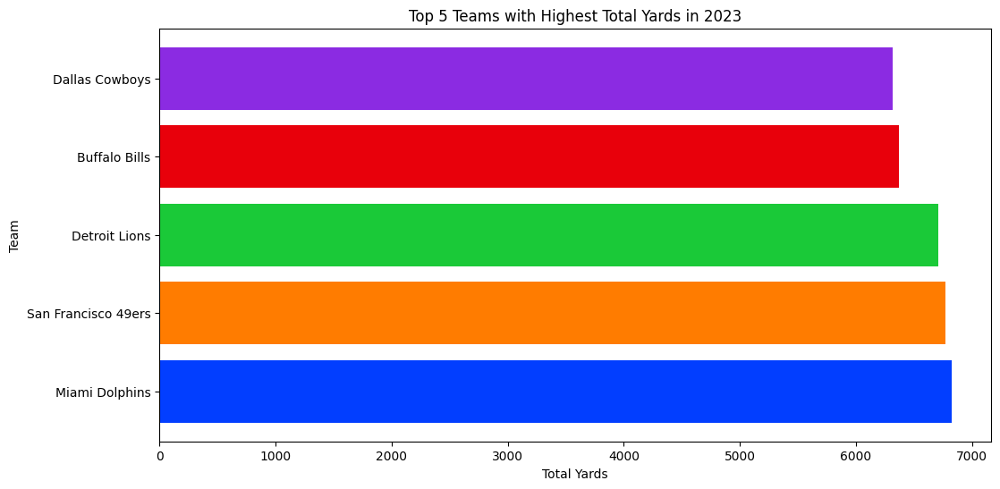

# async-yellow-Kyle-Pham-final-project

[NFL Team Data 2003-2023]([https://www.example.com/link-to-dataset](https://www.kaggle.com/datasets/nickcantalupa/nfl-team-data-2003-2023))

## Why did I chose this dataset?

I chose the NFL stats dataset from 2003-2023 to explore how the game has changed over the years, especially in 2022 and 2023. I'm looking at key stats like total yards, pass completion, and overall team performance. My love for football started as a kid, though I didn’t start playing until high school. As a big 49ers fan, I'm also excited to see how my favorite team has done during this time. This analysis lets me dig deeper into the sport I’ve always been passionate about.
[Placeholder for answer]

## Progress
- [x] Picked dataset
- [x] Defined 10 questions
- [x] Answered 10 questions using Pandas
- [x] Added at least one data visualization (using Matplotlib and/or Seaborn) to each single question
- [x] Prepared presentation slides to present at graduation

## Questions
- [x] Question 1: Who is the top 5 teams that had the most wins over the 2003-2023 seasons?
  - Answer: The top 5 teams that had the most wins over the 2003-2023 seasons were Baltimore Ravens, Green Bay Packers, Indianapolis Colts, New England Patriots, and Pittsburgh Steelers as indicated by the five different colors.
  - Visualization: 

- [x] Question 2: Which 10 teams had scored the most total points from 2003 to 2023 combined?
  - Answer: The top 10 teams who scored the most total points combined from 2003-2003 ranging from first to last is: New England Patriots, New Orleans Saints, Green Bay Packers, Indianapolis Colts, Philadelphia Eagles, Dallas Cowboys, Kansas City Chiefs, Seattle Seahawks, Baltimore Raven, and Vikings. The barplot shows the total points from each team combined and indicates each of them individually by color.
  - Visualization: 

- [x] Question 3: Who were the top 5 teams with the most rushing touchdowns over the 2003-2023 seasons?
  - Answer: Ranking at #1 is New England Patriots (21.4%), #2 Philadelphia Eagles (20.5%), #3 New Orlean Saints (19.6%), #4 Kansas City Chiefs (19.3%), and #5 Carolina Panthers (19.2%).
  - Visualization: 

- [x] Question 4: Who is the top 5 teams that had the most penalties over the years? (2003-2023)
  - Answer: The number #1 spot goes to Arizona Cardinals with over 2310 penalty yards, #2 Baltimore Ravens shying just over 2270, #3 Tampa Bay Bucaneers right under 2270, #4 Dallas Cowboys in between 2250-2260, and lastly #5 Detriot Lions a little over 2240.
  - Visualization: 

- [x] Question 5: Which 5 teams had the most points scored on them (worst defense) 2023?
  - Answer: The top 5 worst defenses that had the allowed the most points scored in 2023 were #1 Washington Commanders over 500, #2 Arizona Cardinals between 400-500, #3 Philadelphia Eagles around 420, #4 Carolina Panthers and #5 Indianapolis Colts with roughly the same of around 410. 
  - Visualization: 

- [x] Question 6: Who were the 5 teams to have the highest winning percentage in 2023?
  - Answer: Ranking in at #1 Baltimore Ravens (78%), following in #2 Dallas Cowboys (70.3%), #3 Detroit Lions (70.2%), #4 San Francisco 49ers (70.2%), and lastly #5 Buffalo Bills (64%). It seems to be that from the #2 to #4 rankings they are quite close however the Cowboys is still ranked aboved Lions and 49ers.
  - Visualization: 

- [x] Question 7: Which 5 teams had the worst winning percentage in 2022?
  - Answer: Now, instead of looking at the 23' season, lets take a look at the 22' season. Ranking in at #1 Chicago Bears (18%), following in #2 Houston Texans (20.5), #3 Arizona Cardinals (23.7%), #4 Indianapolis Colts (26.1%), and lastly %5 Denver Broncos (28.7%). In this graph you can see the upward trend from the worst NFL team in 2022 ranking from #1 to #5. 
  - Visualization: 

- [x] Question 8: Who are the Top 5 teams with the highest pass completion rate in 2023?
  - Answer: Ranking in at #1 Dallas Cowboys (70.1%), #2 Miami Dolphins (69.4%), #3 San Francisco 49ers (68.4%), #4 Cincinnati Bengals (68.3%) and #5 Detroit Lions (67.2%). These are really good percentage, given how these top 5 NFL were able to use there offensive weapons to run down the field.
  - Visualization: 

- [x] Question 9: What are the total offensive attempts from the top 5 teams in the NFL (2023)?
  - Answer: Aside from the highest pass completion rate, lets look at which top 5 teams had the most offensive attempts in 2023. Starting at #1 Cleveland Browns (1142), #2 Detroit Lions (1106), #3 Buffalo Bills (1091), #4 New Orlean Saints (1087), and #5 Dallas Cowboys (1081). The drastic jumps from #1 and #5 is a slight difference of 55 attempts, which isn't that bad.
  - Visualization: 

- [x] Question 10: What are the total yards gained from the top 5 teams in the NFL 2023?
  - Answer: Now taking a look at the Highest Total Yards in 2023, the top 5 NFL teams were: #1 Miami Dolphins (6800yds), #2 San Francisco 49ers (6700yds), #3 Detriot Lions (6600yds), #4 Buffalo Bills (6400yds), and #5 Dallas Cowboys (6350yds). The top 3 three teams were quite close to another, considering the fact the Dolphins had two of the fastest wide receivers yet 49ers kept up with their offensive stars, aswell as the Lions. 
  - Visualization: 
